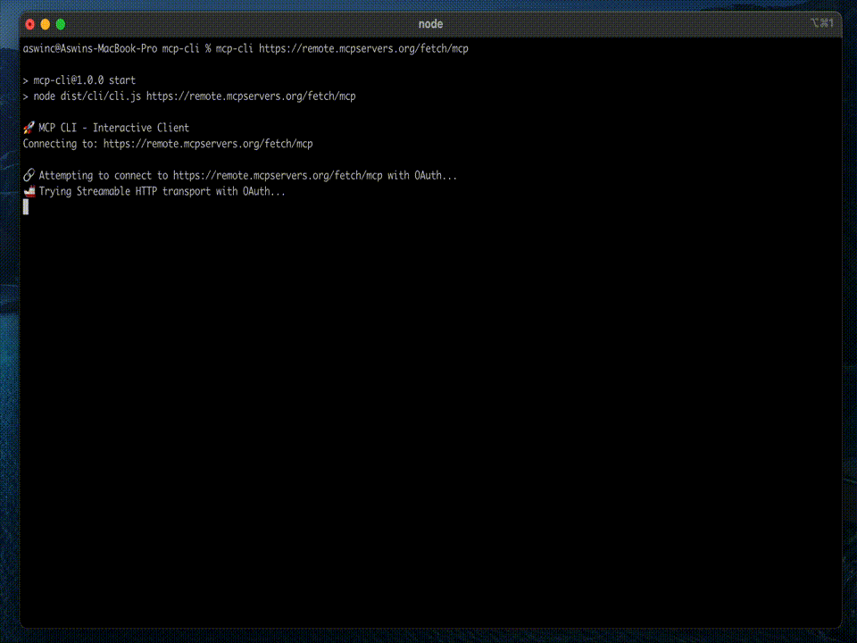

# MCP CLI

Interactive CLI client and library for Model Context Protocol (MCP) servers with OAuth 2.0 support.



## Features

- **Dual Purpose**: Use as CLI tool or integrate as a library
- **OAuth 2.0 Authentication**: Seamless browser-based OAuth flow
- **Transport Fallback**: Automatic fallback from Streamable HTTP to SSE
- **Interactive Shell**: Command-line interface for tool discovery and execution
- **Real-time Notifications**: Support for server-sent notifications

## Installation

Clone and run:
```bash
npm install -g mcp-cli
```

## CLI Usage

### Basic Usage

```bash
# Connect to default server (http://localhost:3000/mcp)
mcp-cli

# Connect to specific server
mcp-cli http://localhost:8080/mcp
mcp-cli https://example.com/mcp
```

### Environment Variables

```bash
# Set default server URL
export MCP_SERVER_URL=http://localhost:8080/mcp
mcp-cli
```

### Interactive Commands

Once connected, you can use these commands:

- `list` - List available tools
- `tool-details <name>` - Show detailed schema for a tool
- `call <tool_name> [args]` - Call a tool with JSON arguments
- `notifications [interval] [count]` - Start notification stream
- `status` - Show connection status
- `help` - Show help message
- `quit` - Exit the client

### CLI Examples

```bash
# List all available tools
mcp> list

# Get details about a specific tool
mcp> tool-details file-operations

# Call a tool with arguments
mcp> call my-tool {"param": "value", "number": 42}

# Start notification stream (interval: 1000ms, count: 10)
mcp> notifications 1000 10
```

## Library Usage

### Basic Example

```typescript
import { MCPClient, BrowserOAuthHandler } from 'mcp-cli';

const client = new MCPClient({
  callbackPort: 8090,
  oauthHandler: new BrowserOAuthHandler()
});

// Set up event handlers
client.on('connected', (transport) => {
  console.log(`Connected via ${transport}`);
});

client.on('error', (error) => {
  console.error('Connection error:', error);
});

// Connect to server
await client.connect('http://localhost:3000/mcp');

// List available tools
const tools = await client.listTools();
console.log('Available tools:', tools);

// Call a tool
const result = await client.callTool('my-tool', { param: 'value' });
console.log('Tool result:', result);

// Clean up
await client.close();
```

### Configuration Options

```typescript
interface MCPClientConfig {
  callbackPort?: number;                    // OAuth callback port (default: 8090)
  oauthMetadata?: OAuthClientMetadata;      // Custom OAuth metadata
  transportPriority?: TransportType[];      // Transport preference order
  connectionTimeout?: number;               // Connection timeout in ms
  oauthHandler?: OAuthHandler;              // Custom OAuth handler
}
```

### Custom OAuth Handler

```typescript
import { CustomOAuthHandler } from 'mcp-cli';

class MyOAuthHandler extends CustomOAuthHandler {
  async handleRedirect(url: string): Promise<void> {
    // Custom redirect handling (e.g., show in app UI)
    console.log('Please visit:', url);
  }

  async waitForCallback(): Promise<string> {
    // Custom callback handling (e.g., from app UI)
    return await getAuthCodeFromUI();
  }
}

const client = new MCPClient({
  oauthHandler: new MyOAuthHandler()
});
```

### Event Handling

```typescript
client.on('connected', (transport) => {
  console.log(`Connected using ${transport} transport`);
});

client.on('disconnected', () => {
  console.log('Disconnected from server');
});

client.on('oauth-redirect', (url) => {
  console.log('OAuth redirect:', url);
});

client.on('oauth-callback-received', (code) => {
  console.log('OAuth code received');
});

client.on('notification', (notification) => {
  console.log('Server notification:', notification);
});

client.on('error', (error) => {
  console.error('Client error:', error);
});
```

### Advanced Usage

```typescript
// Get connection status
const status = client.getConnectionStatus();
console.log('Connected:', status.isConnected);
console.log('Transport:', status.transportType);
console.log('Has OAuth:', status.hasOAuth);

// Get tool details
const toolDetails = await client.getToolDetails('my-tool');
if (toolDetails) {
  console.log('Tool schema:', toolDetails.inputSchema);
}

// Access underlying SDK client (for advanced usage)
const sdkClient = client.getClient();
if (sdkClient) {
  // Use SDK client directly
}
```

## OAuth Flow

The system automatically handles OAuth 2.0 authentication:

1. When connecting to a server that requires OAuth, the system will trigger the OAuth handler
2. Default handler opens your browser for authorization
3. Custom handlers can implement different flows (mobile apps, web apps, etc.)
4. The system automatically receives the authorization code and completes the connection
5. Tokens are managed automatically for the session duration

## Transport Methods

The client tries connection methods in this order:

1. **Streamable HTTP with OAuth** - Primary method with full OAuth support
2. **SSE (Server-Sent Events)** - Fallback method with limited OAuth support

## TypeScript Support

Full TypeScript definitions are included:

```typescript
import { 
  MCPClient, 
  BrowserOAuthHandler, 
  CustomOAuthHandler,
  MCPClientConfig,
  OAuthHandler,
  TransportType,
  ToolDetails,
  Tool,
  OAuthClientMetadata 
} from 'mcp-cli';
```

## Error Handling

The library and CLI provide comprehensive error handling:

- Connection refused errors include server status checks
- Timeout errors suggest network troubleshooting
- OAuth errors provide authorization guidance
- All errors are properly typed and include helpful messages

## Development

### Building from Source

```bash
git clone <repository-url>
cd mcp-cli
npm install
npm run build
```

### Running in Development

```bash
npm run dev  # Watch mode
npm start    # Run built CLI version
```

## License

MIT